<p align="center">
  
</p>

<p align="center">
  
  
  
  
  
  
</p>

<p align="center">
  
</p>

<p align="center">
  
</p>

<p align="center">
  
</p>

## Features

<p align="center">
  
</p>

## Install

Requires Python 3.11+.

<p align="center">
  
</p>

## Quick start

<p align="center">
  
</p>

```text
$ ins -i vlc --dry-run
would install vlc from apt (35.3 KB)

$ ins export manifest.toml          # snapshot: what's installed, per source
$ ins bundle check manifest.toml    # drift report (exit 1 if out of date)
$ ins bundle install manifest.toml  # install what's missing (prompts, -y to skip)
```

## Commands

<p align="center">
  
</p>

## Supported sources

<p align="center">
  
</p>

Sources are auto-detected by tool presence and skipped when absent, so the
same command works on Ubuntu, Fedora, Arch, openSUSE, NixOS, and Alpine.
There is no demo mode: every source is a real package manager.

## Configuration

`ins` reads `~/.config/ins/config.toml` and works with sensible defaults out of
the box:

<p align="center">
  
</p>

## Repos & activity

<p align="center">
  
</p>

## Development

<p align="center">
  
</p>

The test suite replays *real* captured package-manager output
(`tests/output_samples.py`) through a fake subprocess layer, so parsing is
verified against actual tool formats — no mocks of the system calls involved.

## License

<p align="center">
  
</p>

MIT — see [LICENSE](LICENSE). Copyright (c) 2026 Savai.

---

*Every visual on this page is a handcrafted, self-contained animated SVG —
no external image services, nothing to break. Regenerate with
`python3 tools/gen_readme_svgs.py`.*
