<div align="center">

# ins

**One command to find, install, and remove software on Linux — no matter which package manager your distro ships.**


</div>

<br>

`ins` unifies **apt, dnf, pacman, zypper, flatpak, snap, nix, and apk** behind
one simple, beautiful interface. Stop memorizing eight different commands —
one tool does search, install, remove, update, duplicate detection, and
per-package detail views across every source on your system.

<p align="center">
  
</p>

<div align="center">

[Install](#install) · [Quick start](#quick-start) · [Commands](#commands) · [Supported sources](#supported-sources) · [Configuration](#configuration) · [Development](#development)

</div>

---

## Features

#### 🔎 Search
- **One interface for 8 sources** — auto-detects what your distro has
  (apt-get, dnf, pacman, zypper, flatpak, snap, nix-env, apk), then merges
  results so the same app from multiple sources shows up once.
- **Unified search** — parallel queries with typo tolerance
  (`ins -s vcl` still finds VLC), deduplicated and ranked by relevance +
  popularity.
- **Concise results** — at most 20 results per search; if there are more,
  `ins` notes it and suggests refining the query. No paging flags to learn.
- **Web search fallback** — `ins -s <query> -w` also searches GitHub. The
  same table lists matching repositories (`name [web] ★stars`), and the top
  hit can be installed after its exact command is printed and confirmed:
  curated recipes for known tools (opencode, uv, starship), then npm /
  pipx / cargo detection, then GitHub release assets (`.deb`, AppImage,
  binaries) — or just open the repo page. Never auto-runs untrusted scripts.

#### 📦 Install & maintain
- **Safe install/remove** — `pkexec` with a `sudo` fallback, live progress
  from the real package-manager output, confirm-before-install with sizes
  (`-y` skips prompts for scripting).
- **`--dry-run`** — see exactly what install/remove/update/upgrade would do
  (versions, sizes, per-source counts) without touching the system.
- **`ins doctor`** — flags apps installed twice (e.g. `vlc` via apt *and*
  flatpak) and offers to clean up; Ubuntu snap-transition stubs
  (firefox/thunderbird/chromium-browser wrappers) are detected and skipped,
  so removing the duplicate never deletes the real app.
- **`ins info`** — license, homepage, size, version, and install state per
  source, in one glance.
- **`ins -u`** — updates every detected source in sequence with a summary,
  plus tool updaters: `pipx upgrade-all`, `uv tool upgrade --all`,
  `rustup update`, and any custom commands from
  `~/.config/ins/config.toml` (`[updaters] custom = { texlive = ["tlmgr", "update", "--all"] }`).
  Only no-password updaters run by default; `fwupdmgr refresh` (firmware
  metadata) is opt-in via `enable = ["fwupd"]` because it can prompt for
  admin rights and downloads firmware metadata.
- **`ins -l` / `ins -o` / `ins -U <pkg>...`** — list installed packages,
  see which have newer versions available, and upgrade them individually.

#### 🔄 Share & automate
- **`ins export` / `ins bundle`** — declarative provisioning: dump what's
  installed to a TOML manifest, check drift, and reinstall it on a fresh box.
- **`ins history` / `ins undo`** — every install/remove/upgrade is recorded;
  `ins undo` reverses the last one (removes what you installed, reinstalls
  what you removed), with a state check before acting.
- **`--json`** — machine-readable output for scripting.
- **Completions** — `ins completions bash|zsh|fish` prints a completion script,
  and package names auto-complete for `-i`/`-r`/`-U`/`info` via
  `ins completions packages [--installed] <prefix>`.

#### ✨ Quality of life
- **Quiet mode** — `-q` silences success messages (errors still print) and
  `--no-progress` drops the live progress bar for pipelines.
- **Offline-friendly** — local SQLite cache with TTL; stale results are marked
  instead of failing when a source is unreachable.
- **Pretty** — pastel-colored source tags, aligned tables, spinners, and an
  erase animation on remove.

---

## Install

Requires Python 3.11+.

<p align="center">
  
</p>

```bash
# one-line installer (pipx, falls back to pip --user)
curl -sSL https://raw.githubusercontent.com/savai15/ins/main/install.sh | bash

# or, if you already use pipx
pipx install git+https://github.com/savai15/ins

# or with pip
pip install --user git+https://github.com/savai15/ins
```

Optional inline icons in `ins info` (kitty / iTerm2 / WezTerm only):

```bash
pipx inject ins term-image        # or: pip install --user 'ins[icons]'
```

Shell completions for bash / zsh / fish ship with the package, or print them
on demand (package names auto-complete for `-i`, `-r`, `-U`, and `info`):

```bash
# bash
ins completions bash > ~/.local/share/ins.bash && echo 'source ~/.local/share/ins.bash' >> ~/.bashrc

# zsh
ins completions zsh > ~/.zsh/completions/_ins && fpath+=(~/.zsh/completions) && compinit

# fish
ins completions fish > ~/.config/fish/completions/ins.fish
```

A man page ships with the package too:

```bash
man ins
```

---

## Quick start

Every action takes an explicit flag or subcommand — bare `ins` prints the
grouped command list (search & install / maintain / share / options):

```text
$ ins
'ins' — universal CLI package search/install tool for Linux

                     search & install
╭──────────────────┬──────────────────────────────────────────────╮
│Command           │Description                                   │
├──────────────────┼──────────────────────────────────────────────┤
│-s, --search <q>  │search all sources, typo-tolerant, merged &   │
│                  │ranked                                        │
│-i, --install     │install one or more packages (confirm + live  │
│<pkg>...          │progress)                                     │
│-r, --remove      │remove one or more installed packages         │
│<pkg>...          │                                              │
│-U, --upgrade     │upgrade one or more installed packages        │
│<pkg>...          │                                              │
│info <pkg>        │detailed view of a package                    │
╰──────────────────┴──────────────────────────────────────────────╯
                    maintain
╭──────────────┬─────────────────────────────────────────────────╮
│Command       │Description                                      │
├──────────────┼─────────────────────────────────────────────────┤
│-u, --update  │refresh every source's index, then tool updaters │
│-l, --list    │list installed packages grouped by source        │
│-o, --outdated│show packages with newer versions available      │
│doctor        │scan for duplicate installs across sources       │
│history [n]   │show recent transactions (default 20)            │
│undo          │reverse the last install or remove               │
╰──────────────┴─────────────────────────────────────────────────╯
                    share
╭────────────────────────────┬───────────────────────────────────╮
│Command                     │Description                        │
├────────────────────────────┼───────────────────────────────────┤
│export [file]               │write installed packages as a TOML │
│                            │manifest                           │
│bundle check <file>         │drift report: manifest vs          │
│                            │installed packages                 │
│bundle install <file>       │install packages a manifest is     │
│                            │missing                            │
│completions <shell\|packages>│print a completion script or       │
│                            │package names                      │
╰────────────────────────────┴───────────────────────────────────╯
```

Or search directly — merged across sources, deduplicated, typo-tolerant:

```text
$ ins -s vcl
'vcl'
╭───────────────────────────────────┬───────────────────────────────────────╮
│Package                            │Description                            │
├───────────────────────────────────┼───────────────────────────────────────┤
│vlc [apt] 3.0.23-1                 │VLC is the VideoLAN project's media    │
│also via: snap                     │player. It plays MPEG, MPEG-2, MPEG-4, │
╰───────────────────────────────────┴───────────────────────────────────────╯
```

**More than 20 results?** `ins` shows the top 20 and tells you how many
more match — refine your query to see the rest. No page flags to juggle.

**Not in any local source?** Add `-w` to search GitHub too. The exact
install command is printed and confirmed before it runs —

```text
$ ins -s opencode -w
opencode [web] ★ 218k          opencode is the AI coding agent…
$ # asked: Install 'opencode' from web? → y
Plan: curl -fsSL https://opencode.ai/install | bash
Run this command? [y/N] y
✓ installed opencode (web)
```

Web installs are resolved from a curated recipe table, then npm / pipx /
cargo presence, then GitHub release assets (`.deb`/AppImage/binary). If
nothing verifiable is found `ins` just offers to open the repo page — it
never auto-runs arbitrary remote scripts. `[web]` config (timeout, token)
lives in `~/.config/ins/config.toml`; web-installed tools are not tracked
by `-l`/`-u`/`-U`.

**Install a GitHub tool directly** — `ins -i <name>` checks local sources
first; if the name isn't there, it searches GitHub and offers to install on
an exact repo-name or `owner/repo` match, with the same confirm-first flow
(works with `-y` and `--dry-run`).

Install (batch works too), with live progress:

```text
$ ins -i vlc git -y
✓ installed vlc from apt
✓ installed git from apt
```

Remove with a dim→collapse→gone erase animation on real terminals:

```text
$ ins -r vlc -y
✓ removed vlc from apt
```

Update every source plus tool updaters, with a summary:

```text
$ ins -u
apt: up to date
snap: 2 update(s)
pipx: ran
✓ 2 packages updated across snap
```

See what's installed and what has updates, then upgrade:

```text
$ ins -l
Installed packages
╭──────────────────────────────┬──────────────────────────────╮
│Package                       │Version                       │
├──────────────────────────────┼──────────────────────────────┤
│vlc [apt]                     │3.0.23-1                      │
│vlc [snap]                    │3.0.20                        │
╰──────────────────────────────┴──────────────────────────────╯

$ ins -o
Updates available
╭──────────────────────────────┬──────────────┬──────────────╮
│Package                       │Installed     │Available     │
├──────────────────────────────┼──────────────┼──────────────┤
│vlc [apt]                     │3.0.20        │3.0.23-1      │
╰──────────────────────────────┴──────────────┴──────────────╯

$ ins -U vlc -y
✓ upgraded vlc from apt
```

Preview before touching anything (works for `-i`, `-r`, `-u`, `-U`, with `--json`):

```text
$ ins -i vlc --dry-run
would install vlc from apt (35.3 KB)
```

Provision a machine from a manifest:

```text
$ ins export manifest.toml          # snapshot: what's installed, per source
$ ins bundle check manifest.toml    # drift report (exit 1 if out of date)
$ ins bundle install manifest.toml  # install what's missing (prompts, -y to skip)
```

Detail view per source — license, homepage, and size in one glance:

```text
$ ins info vlc
vlc
VLC is the VideoLAN project's media player. It plays MPEG, MPEG-2, MPEG-4,
DivX, MOV, WMV, QuickTime, WebM, FLAC, MP3, Ogg/Vorbis files, DVDs, VCDs,
podcasts, and multimedia streams from various network sources.
sources
╭────────────┬─────────────────────┬────────┬──────────────┬───────╮
│Source      │Version              │   Size │State         │License│
├────────────┼─────────────────────┼────────┼──────────────┼───────┤
│[apt]       │3.0.23-1             │35.3 KB │not installed │—      │
│[snap]      │3.0.20-1-g2617de71b6 │      — │not installed │—      │
╰────────────┴─────────────────────┴────────┴──────────────┴───────╯
homepages
  [apt] https://www.videolan.org/vlc/
```

Duplicate check + resolution:

<p align="center">
  
</p>

```text
$ ins doctor
Duplicate installations
╭──────────┬───────────────────┬──────────────╮
│Package   │Installed via      │Versions      │
├──────────┼───────────────────┼──────────────┤
│vlc       │[apt] [snap]       │3.0.23-1      │
│          │                   │3.0.20        │
╰──────────┴───────────────────┴──────────────╯
sources: 2/8 detected (apt, snap)
cache: 4 entries, 0.03 MB (.../ins/cache.db)
config: ~/.config/ins/config.toml
Remove 'vlc' from snap? [y/N]
```

JSON for scripts:

```json
$ ins -s vlc --json
{
  "query": "vlc",
  "results": [
    {
      "name": "vlc",
      "source": "apt",
      "version": "3.0.23-1",
      "installed": true,
      "also_via": ["snap"],
      "alternatives": [ ... ]
    }
  ]
}
```

---

## Commands

| Command             | What it does                                        |
| ------------------- | --------------------------------------------------- |
| `ins`               | show the full command list, grouped by category     |
| `ins -s <q>`        | search all sources, merged + ranked                 |
| `ins -s <q> -w`     | also search GitHub — web-installed tools aren't tracked by `-l`/`-u`/`-U` |
| `ins -i <pkg>...`   | install one or more packages (`-y` to skip prompt; falls back to GitHub on exact repo match)  |
| `ins -r <pkg>...`   | remove one or more packages                         |
| `ins -u`            | update every detected source's index + tool updaters  |
| `ins -l`            | list installed packages grouped by source          |
| `ins -o`            | list packages with newer versions available        |
| `ins -U <pkg>...`   | upgrade installed packages                         |
| `ins export [file]` | write installed packages as a TOML manifest         |
| `ins bundle check <file>` | compare a manifest against installed state    |
| `ins bundle install <file>` | install what the manifest is missing       |
| `ins info <pkg>`    | detail view: license, homepage, size per source     |
| `ins doctor`        | find + resolve duplicate installs                   |
| `ins history [n]`   | show the last n install/remove/upgrade transactions (default 20) |
| `ins undo`          | reverse the last install or remove transaction      |
| `ins completions <bash\|zsh\|fish\|packages>` | print a completion script or package names |
| `--s <source>...`  | restrict any action to specific sources (`web` = only GitHub) |
| `--dry-run`         | preview install/remove/update/upgrade without changing anything |
| `--json`            | machine-readable output (search, info, list, outdated, bundle check, doctor, update, dry-run, history) |
| `-q / --quiet`      | suppress success messages and progress (errors still shown) |
| `--no-progress`     | run without the live progress bar                   |
| `-y / --yes`        | assume yes (scripting)                              |

---

## Supported sources

| Source   | Search            | Install/Remove          | Update            | Outdated              | Upgrade                 |
| -------- | ----------------- | ----------------------- | ----------------- | --------------------- | ----------------------- |
| apt      | python-apt or apt-cache | `apt-get -y` (pkexec/sudo) | `apt-get update` | `apt list --upgradable` | `apt-get install --only-upgrade` |
| flatpak  | `flatpak search`  | `flatpak install/uninstall --user` | `flatpak update --user` | `flatpak remote-ls --updates` | `flatpak update --user` |
| dnf      | `dnf search -q`   | `dnf install/remove -y`  | `dnf upgrade -y` | `dnf list --upgrades`  | `dnf upgrade -y`        |
| pacman   | `pacman -Ss`      | `pacman -S/-R --noconfirm` | `pacman -Sy`   | `pacman -Qu`           | `pacman -S --noconfirm` |
| zypper   | `zypper -q search`| `zypper -n install/remove` | `zypper -n refresh` | `zypper -q list-updates` | `zypper -n update`   |
| snap     | `snap find`       | `snap install/remove`    | `snap refresh`  | `snap refresh --list`  | `snap refresh`          |
| nix      | `nix search nixpkgs` | `nix-env -iA/-e`      | `nix-channel --update` | — (resolved at run time) | `nix-env -u`         |
| apk      | `apk search -d`   | `apk add/del`            | `apk update`    | `apk upgrade -s`       | `apk add -u`            |

Sources are auto-detected by tool presence and skipped when absent, so the
same command works on Ubuntu, Fedora, Arch, openSUSE, NixOS, and Alpine —
`ins -s vlc` just shows you `[apt]` or `[dnf]` or `[pacman]` depending on the
box. There is no demo mode: every source is a real package manager.

---

## Configuration

`ins` reads `~/.config/ins/config.toml` and works with sensible defaults out of
the box:

<p align="center">
  
</p>

```toml
[sources]
priority = ["apt", "flatpak", "dnf", "pacman", "zypper", "snap", "nix", "apk"]

[cache]
enabled = true
ttl_seconds = 3600
max_entries = 5000

[updaters]
# built-in tool updaters to skip: pipx, uv, rustup
disable = []

# opt-in privileged/network updaters (e.g. fwupd — its metadata refresh
# can prompt for admin rights and downloads firmware metadata)
enable = ["fwupd"]

# extra update commands run by `ins -u` (name = argv list)
custom = { texlive = ["tlmgr", "update", "--all"] }
```

---

## Development

<p align="center">
  
</p>

```bash
git clone https://github.com/savai15/ins && cd ins
pip install -e ".[dev]"
pytest -q        # 270 tests, all subprocess calls stubbed with real Linux output
ruff check .     # lint (CI enforces both on Python 3.11/3.12/3.13)
```

The test suite replays *real* captured package-manager output
(`tests/output_samples.py`) through a fake subprocess layer, so parsing is
verified against actual tool formats — no mocks of the system calls involved.

---

## License

MIT — see [LICENSE](LICENSE). Copyright (c) 2026 Savai.
